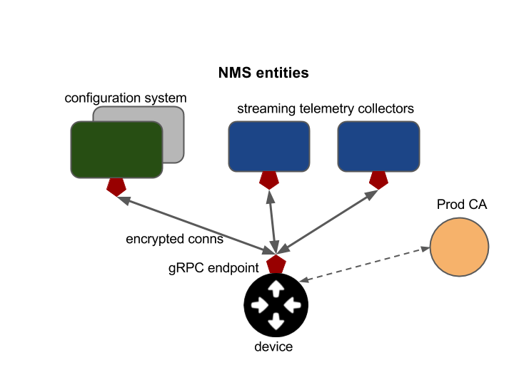
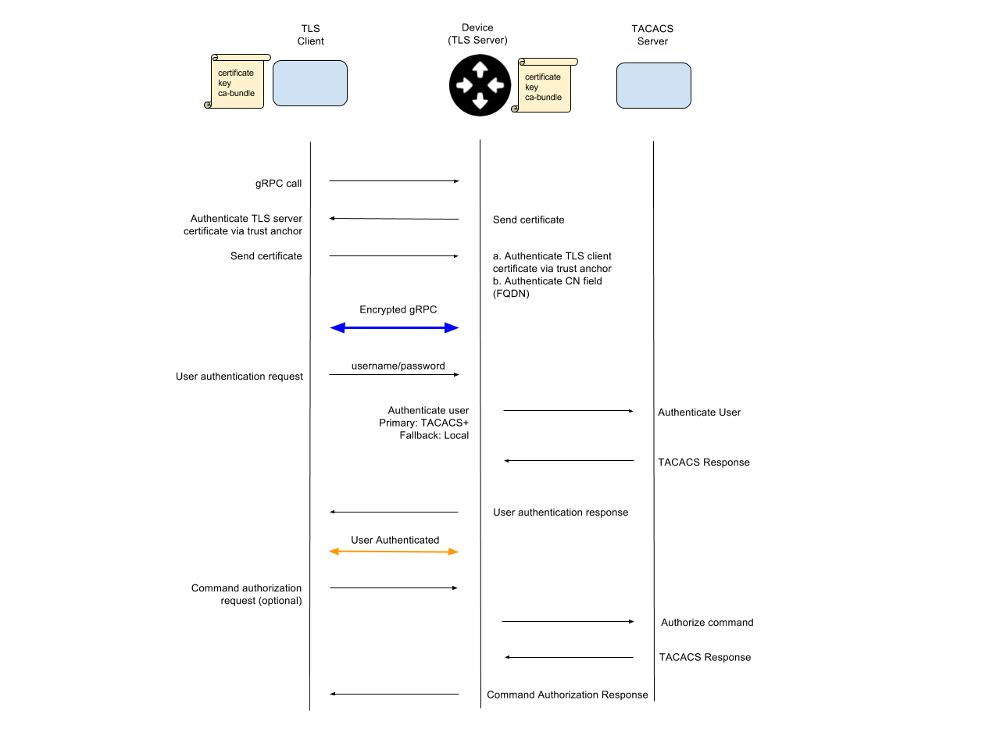

## gNMI Authentication and Encryption

**Updated**: July 26, 2019
**Version:**: 0.1.1

#### Background

Network devices managed by the gRPC Network Management Interface ([gNMI](https://github.com/openconfig/reference/blob/master/rpc/gnmi/gnmi-specification.md)) must support secure bidirectional communication over a [gRPC](http://www.grpc.io/) channel, along with standard authorization and accounting of all management operations.  An example of the primary entities of a gNMI-based management system is shown in the figure below.  The configuration system and telemetry collectors act as RPC clients to the network device (target).  The target exposes the gNMI service with methods for subscribing to telemetry streams or sending configuration data.

#### Requirements on the network device (gNMI target)

*   Allow installation of an X.509 PEM certificate and private key to enable server authentication for the TLS connection.
*   Verify that certificates are valid on both sides and authenticate either with the gRPC-contained user and password, or the CN in the client certificate.
*   Accept username / password credentials for authentication operations.
*   Accept username to authorize operations against the device's standard AAA (generally, TACACS) mechanisms.
*   Use a single gRPC endpoint service for all operations (with separate RPCs supporting configuration and telemetry operations).  Each client (e.g., telemetry collector or configuration system) may open a separate channel with its own authentication credentials.
*   Leverage [gRPC authentication](http://www.grpc.io/docs/guides/auth.html) support.

#### Encryption

*   All communication between gRPC client and server must be encrypted by TLS (TLS 1.2). The gRPC channel must be in an encrypted state before it is considered usable.
*   If the client and server are unable to negotiate an encrypted channel, the channel establishment should fail with an error.
*   Fallback to unencrypted communication is prohibited.
*   The network element will perform certificate based validation of the connecting network management system to ensure the endpoint is an authorized entity.
*   The target must provide a means for the operator to install a certificate bundle on the network element, and the target must use the supplied bundle to validate incoming connections to the network element.
*   The target must support a process to periodically rotate the keyfile/certificate bundle.

#### Credentials and Authentication

*   Configuration operations carried over the encrypted connection will carry credentials (username/password) in the metadata 
of each gRPC message.  Configuration changes require a user with Read-Write permission.
*   The target will use these credentials to authorize the configuration operation using currently available AAA methods on 
the network element.
*   The network element uses the local AAA configuration to determine where and what type of AAA request to issue.
    *   For example, on a network element configured to use TACACS for command authorization, a <code><em>Get(/interfaces)
   </em></code> request for user:password would trigger a TACACS command authorization request using the same username.
*   Future versions of the authentication scheme may use a username/password credential carried inside a field of the X.509 
certificate, rather than exclusive use of RPC metadata.

#### Telemetry Authentication

*   Each telemetry message will not be authenticated with a username/password, as this is redundant and will not be a 
performant solution.
*   Each telemetry message will only be carried over the encrypted gRPC streaming channel which was previously authenticated.
*   Telemetry <code><em>Subscribe()</em></code> RPCs require a username/password credential inside the metadata.  The 
Subscribe and Get RPCs do not make configuration changes to a device and thus should be allowed for users with Read-Only or
Read-Write permissions.

**Contributors**: Alex Bogdanov, Josh George, Carl Lebsack, Chris Morrow, Anees Shaikh, Rob Shakir

## Appendix - gRPC Authentication Flow Diagram

